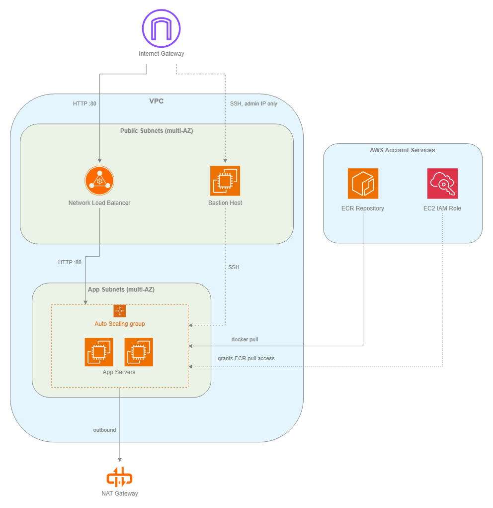

# Scalable AWS Web Platform

A production-style AWS infrastructure project built entirely in Terraform: a VPC with public and private tiers, a load-balanced and auto-scaled application layer, a bastion host for controlled SSH access, and a container registry, all wired together with least-privilege security groups and IAM roles.

## About The Project

This project provisions a small but realistic web platform on AWS, the kind of network and compute layout a real production service would sit behind. A minimal Express app is included as the sample workload, but the actual subject of this project is the infrastructure around it: network segmentation, controlled ingress, autoscaling, and IAM-based access to a container registry, rather than the application itself.

### Core Features

- VPC with distinct public and app subnet tiers, spread across multiple availability zones
- Application servers behind a Network Load Balancer, running as an Auto Scaling Group
- Bastion host as the only SSH entry point, reachable exclusively from a configured admin IP
- Least-privilege security groups: the app tier is only reachable from the NLB and the bastion, never directly from the internet
- Application and bastion AMIs are resolved dynamically to the latest Amazon Linux 2023 image at apply time, rather than pinned to a fixed, aging AMI ID
- IAM role granting app servers pull-only access to a private ECR repository, no long-lived credentials on the instances
- Fully defined as code with Terraform, modularized by concern (`vpc`, `security`, `iam`, `ecr`, `compute`, `nlb`, `bastion`)

### Architecture



The editable diagram source is at `docs/architecture/architecture.drawio` ([draw.io](https://app.diagrams.net)).

**Traffic flow:** the internet reaches the app tier only through the Network Load Balancer; the only path to SSH into anything is through the bastion host, and only from the configured admin IP; app servers pull their container image from ECR at boot, authorized by an attached IAM role rather than stored credentials.

## Built With

- **Infrastructure:** Terraform, AWS (VPC, EC2, Auto Scaling, Network Load Balancer, ECR, IAM)
- **Sample application:** Node.js, Express, Docker
- **Diagramming:** draw.io

## Prerequisites

- [Terraform](https://developer.hashicorp.com/terraform/install) (CLI)
- An AWS account with credentials configured locally (`aws configure`)
- [Docker](https://www.docker.com/), for building and pushing the app image
- An SSH key pair for bastion access (see step 2 below)

> **Cost warning:** running `terraform apply` creates real, billable AWS resources (EC2 instances, a Network Load Balancer, a NAT Gateway, and others). Run `terraform destroy` when you're done to avoid ongoing charges.

## How to Run

### 1. Configure your variables

```bash
cd terraform
cp terraform.tfvars.example terraform.tfvars
```

Fill in your own values:

| Variable | Description |
|---|---|
| `project_name` | Prefix used for naming every resource this creates |
| `ecr_repo_name` | Name for the ECR repository that will be created |
| `admin_ip` | Your own public IP, in CIDR form (e.g. `["203.0.113.10/32"]`), the only address allowed to SSH into the bastion |
| `aws_region` | Defaults to `eu-west-3`, override if you want a different region |
| `instance_type` | Defaults to `t3.micro` |

### 2. Generate a key pair for the bastion

Terraform expects an existing key pair in this folder, it does not generate one for you:

```bash
ssh-keygen -t ed25519 -f bastion-key -N ""
```

This creates `bastion-key` (private, keep it out of version control, already gitignored) and `bastion-key.pub` (public, read directly by Terraform).

### 3. Create the ECR repository first

The application servers pull their image from ECR at boot, so the repository has to exist, and the image has to be pushed, before the rest of the infrastructure comes up:

```bash
terraform init
terraform apply -target=module.ecr
```

### 4. Build and push the app image

```bash
cd ../app
aws ecr get-login-password --region <your-region> | docker login --username AWS --password-stdin <your-account-id>.dkr.ecr.<your-region>.amazonaws.com

docker build -t <your-ecr-repo-name> .
docker tag <your-ecr-repo-name>:latest <your-account-id>.dkr.ecr.<your-region>.amazonaws.com/<your-ecr-repo-name>:latest
docker push <your-account-id>.dkr.ecr.<your-region>.amazonaws.com/<your-ecr-repo-name>:latest
```

### 5. Provision the rest of the infrastructure

```bash
cd ../terraform
terraform apply
```

Review the plan output before confirming, since this stage creates the VPC, load balancer, autoscaled app servers, and bastion host.

### 6. Connect to the bastion (optional)

```bash
ssh -i bastion-key ec2-user@<bastion-public-ip>
```

The bastion's public IP is available in the `terraform apply` output.

### 7. Tear it down

```bash
terraform destroy
```

## Validating the Infrastructure

Before applying changes, check formatting and validity:

```bash
cd terraform
terraform fmt -check
terraform validate
```

> A CI pipeline running these checks automatically on every push is on the roadmap below.

## Project Structure

```
scalable-aws-web-platform/
├── app/                Sample Express workload, containerized
├── terraform/
│   ├── main.tf         Wires all modules together
│   ├── variables.tf
│   ├── terraform.tfvars.example
│   └── modules/
│       ├── vpc/        Network: subnets, route tables, NAT
│       ├── security/   Security groups, least-privilege rules
│       ├── iam/        EC2 role with ECR pull access
│       ├── ecr/        Container registry
│       ├── compute/    Auto Scaling Group, launch template
│       ├── nlb/        Network Load Balancer
│       └── bastion/    Bastion host
├── docs/
│   └── architecture/   Architecture diagram (source + exported image)
└── README.md
```

## Roadmap / Future Improvements

- [ ] CI pipeline running `terraform fmt -check`, `terraform validate`, and a security scanner (`tflint`/`checkov`) on every push
- [ ] Automated image build-and-push step, rather than the manual Docker steps above
- [ ] NAT Gateway per availability zone, instead of a single shared one, for higher availability
- [ ] Automated tests for the sample application

## License

This project was built as a personal portfolio piece and is not licensed for production use.